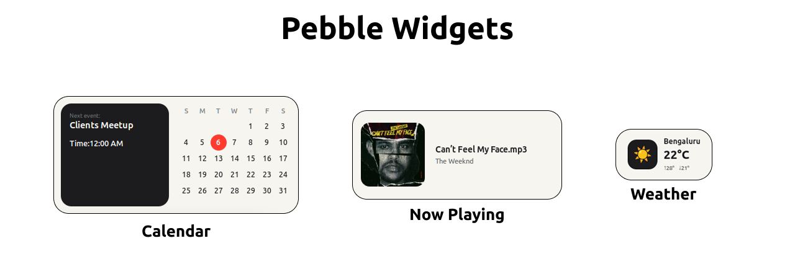
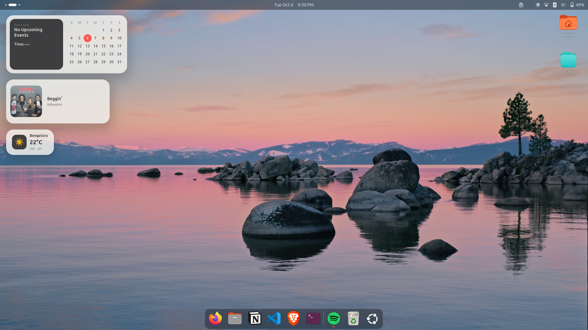
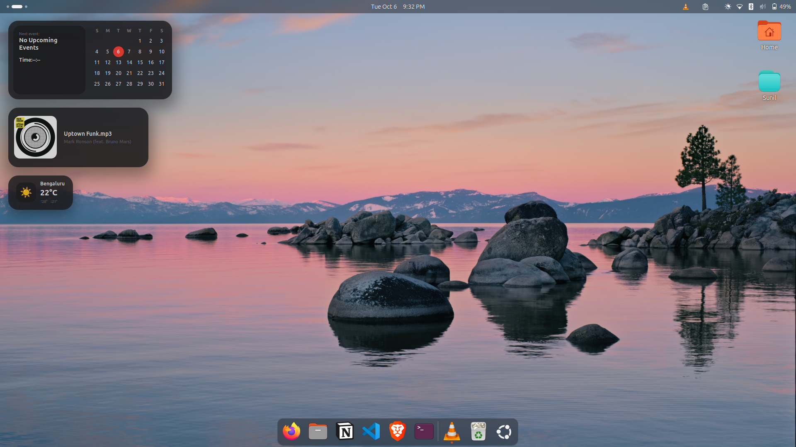
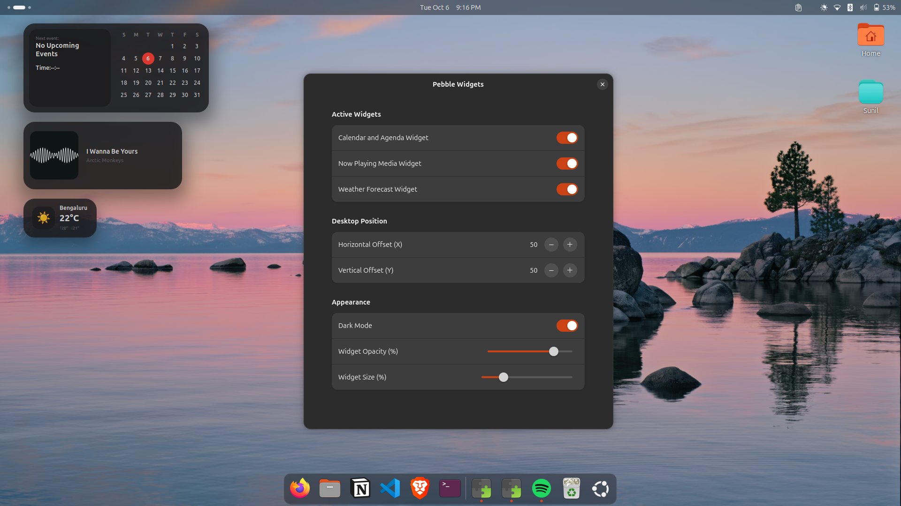

# Pebble Widgets for GNOME

A collection of clean, modern, and adaptive desktop widgets for GNOME Shell. Pebble Widgets blends smooth rounded aesthetics, organic elevation shadows, and deep system integration into your desktop workspace.



---

## ✨ Features

- **📅 Calendar & Agenda Card**: Automatically synchronizes with your Ubuntu/GNOME calendar to display your upcoming events alongside a monthly date grid.
- **🎵 Now Playing Media Card**: Integrates with MPRIS (Spotify, VLC, web browsers) to display active playback details and high-resolution album artwork, complete with a clean fallback state.
- **⛅ Live Dynamic Weather**: Automatically detects your location via IP geolocation and fetches current conditions, daily highs/lows, and weather icons through Open-Meteo—zero API key configuration required.
- **🌓 Light & Dark Theme Support**: Seamlessly switch between a soft cream light palette and a deep charcoal dark mode.
- **🎛️ Full Customization**: Adjust desktop positioning (X/Y offsets), variable opacity (20%–100%), and proportional diagonal vector scaling (50%–200%) directly from the Preferences panel.

---

## 📸 Screenshots

| Light Mode | Dark Mode | Settings |
| :---: | :---: | :---: |
|  |  |  |

---

## 📋 Requirements

Pebble Widgets uses `playerctl` to interact seamlessly with MPRIS media players:

```bash
sudo apt install playerctl
```

## 🚀 Installation

### Option 1: Via GNOME Extensions (Recommended)

Install directly from extensions.gnome.org once published, or use Extension Manager:

1. Open Extension Manager.
2. Search for Pebble Widgets.
3. Click Install.

Option 2: Manual Installation from Source

1. Clone the repository into your local GNOME extensions directory:

```bash
git clone https://github.com/SunilGopalCV/pebble-widgets ~/.local/share/gnome-shell/extensions/pebble-widgets@sunil
```

2. Compile the GSettings schema:

```bash
glib-compile-schemas ~/.local/share/gnome-shell/extensions/pebble-widgets@sunil/schemas/
```

3. Restart GNOME Shell:

- Wayland: Log out and log back in.
- X11: Press Alt + F2, type r, and press Enter.

4. Enable the extension:

```bash
gnome-extensions enable pebble-widgets@sunil
```

## ⚙️ Configuration

Open Extension Manager or run:

```bash
gnome-extensions prefs pebble-widgets@sunil
```

From here you can:
Toggle individual widgets on or off.
Set desktop pixel coordinates ($X$ and $Y$ offsets).
Toggle Dark Mode.
Adjust background opacity and global vector scaling.

## 🛠️ Tech Stack & Architecture

Runtime: GJS (GNOME JavaScript Engine with ES Modules)
UI Toolkit: Clutter / St (Shell Toolkit) & Libadwaita for settings
IPC / APIs: DBus (MPRIS v2), Soup 3.0 (HTTP), Open-Meteo REST API

## 📄 License

Distributed under the GPL-3.0 License.